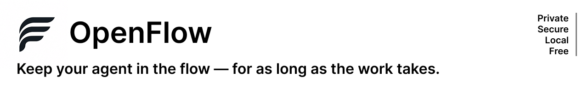

[](https://opensource.org/licenses/MIT)
[](https://discord.gg/aKCtcBQ2w)
[](https://github.com/stevenpal/openflow/stargazers)

# OpenFlow

**Keep your agent in the flow — for as long as the work takes. Secure. Private. And Local.**

A local, versioned memory of the streams — documents, threads, queries, conversations — that
flow into your work, built for coding-agent harnesses like Claude Code, Cursor, and Codex.

OpenFlow lets a knowledge worker point an agent at the things they actually track — a Slack
thread, a Google Doc, a SQL dashboard, a PDF someone sent them — and keep working with that agent
across sessions without re-explaining what changed or why any of it matters. The agent syncs each
tracked source, diffs it against the last version it saw, and turns anything worth your attention
into a queue item you can act on — instead of you re-reading whole documents or re-pasting context
every time you open a new chat.

Everything in OpenFlow is organized around your **intents** — the actual things you're trying to
get done — not around generic per-document summaries. A stream is never tracked "just because";
it's tracked *for* one or more specific reasons, and those reasons are what the agent uses to
decide what's worth surfacing when a source changes, and how to group the queue when you sit down
to work. Knowledge work is dynamic — the streams you track today may serve a different purpose
next month, or serve two purposes at once — so intents are living text the agent keeps current,
not a fixed label applied once at ingest time.

## Who it's for

OpenFlow is for anyone whose job is tracking a shifting set of documents, threads, and
conversations, and who wants an agent to carry that context forward instead of re-reading and
re-pasting it every session.

- **Product managers** — track a PRD, the engineering thread debating a tradeoff, and customer
  feedback rolling in, all tied to the same launch decision.
- **Product marketing managers** — watch positioning docs, competitive intel, and sales channel
  chatter for anything that should change messaging before it ships.
- **Analysts** — follow a dashboard or query alongside the Slack thread discussing what the
  numbers mean, so a metric change and its context never drift apart.
- **Sales and sales operations** — keep tabs on deal threads, pricing docs, and territory
  discussions without re-reading a channel's full history before every call.
- **Engineering managers** — track design docs, incident threads, and planning discussions across
  multiple teams, and get flagged the moment a decision affects a commitment.

## Quick Setup

```
npm install -g @stevenpal/openflow@latest
mkdir my-workspace && cd my-workspace
openflow init
```

## Core workflow

All day-to-day work happens through slash commands and skills your agent harness loads from the workspace:

| Command | What it does |
|---|---|
| `/flow:add` | Add a stream — a file, URL, or description of a live source. Classifies it as static or syncable, takes an initial snapshot, and records the **intent** — why you're tracking it — as its first entry. |
| `/flow:sync` | Pull the latest version of every syncable stream, diff it against the last snapshot, match what changed against each stream's intents, and turn what's relevant into queue items or direct action. |
| `/flow:manage` | Toggle a stream between syncable and static, or remove it from the workspace (never touches the remote source itself). |
| `/flow:work` | Pick up the queue cold — grouped by **intent**, not a flat per-source list — and work through it with the agent. Syncs just the stream(s) involved before acting on them. |
| `/flow:ask` | Ask a question across everything currently tracked, when it doesn't map to one queue item. |

## A Typical Day with OpenFlow

A typical session looks like:

```
$ cd my-workspace
$ claude
```

**Track the PRD:**

> `/flow:add' https://docs.google.com/...`
> This is the PRD I'm working on to outline the requirements for the Q4 mobile launch — we'll
> need to iterate on feedback from engineering, design, and sales.

```
Added "Acme Q4 mobile launch PRD" to tracked streams with intent: "..."
```

**Track the sales channel:**

> `/flow:add https://acme.slack.com/...`
> Let's track this Slack channel we have going with the APAC sales team — there's a lot of
> chatter about the upcoming launch, including feedback from customers and prospects that may
> drive changes to positioning and messaging.

```
Added "Acme APAC sales team" to tracked streams with intent: "..."
```

**Sync and see what's new:**

> `/flow:sync`

```
There were 3 new comments in the PRD, all from the engineering team. They said that we'll have
to make a decision between X and Y if we want to hit the launch date ...

There were 25 new messages in the APAC sales team Slack channel, mostly from the sales team
about the upcoming launch, but a few that could drive pricing changes depending on ...

I added two items to your work queue based on these. Do you want to act on these now?
```

**Work the queue:**

> `/flow:work`
> Regarding the engineering team's concerns, let's update the PRD to reflect the following
> decision regarding X and Y .... Also, let's share a summary of that decision in the
> Engineering Slack channel so that folks are aware. On the APAC sales thoughts on pricing, can
> you help me think through the pricing options relative to competitor Z? Let's come up with two
> options and share them with the sales team for feedback.

```
I updated the Requirements list section of the PRD to reflect ....

Based on the PRD and the Slack discussion, there are three factors that could impact the
pricing decision: ...
```

`/flow:add` and `/flow:sync` can also act immediately — editing a doc, posting a reply — whenever
the right move is obvious, rather than always deferring to the queue.

## What are streams?

A **stream** is anything OpenFlow tracks on your behalf — a document, a thread, a query, a
conversation, a feed. Every stream is added for a reason (its intent), and every stream has an
origin:

- **Source streams** are pulled straight from wherever they live: a Google Doc, a Slack channel or
  thread, a PDF someone sent you, a SQL query against a dashboard, a web page. `/flow:sync` fetches
  the latest version, diffs it against the last snapshot, and matches what changed against the
  stream's intents.
- Streams can also be **static** instead of syncable — a one-time snapshot that's never pulled
  again, useful for reference material that isn't expected to change.

**Derived streams** are a second kind of stream: instead of coming from an external source, a
derived stream is computed from one or more source streams already in your workspace, using a
transformation recipe you define once. It behaves like any other stream for the purposes of
intents and the queue, but its content comes from a recipe applied to its sources rather than a
pull from the outside world.

This is useful because raw source streams are often not the shape you actually need. Say you're
syncing a handful of streams that are really queries against a database or reports pulled from
other systems — they land as CSV or JSON, one snapshot at a time. On their own that's just data;
what you're usually after is a transformation of it in service of some intent: a report that
surfaces trends or anomalies across the raw numbers, or just the latest headline figures — total
adoption so far, revenue this quarter — that you need to drop into a weekly report for senior
management or feed into other ongoing analysis. Rather than doing that transformation by hand
every time a source refreshes, you define it once as a derived stream, and the agent re-derives it
automatically whenever `/flow:sync` detects that one of its source streams changed.

A derived stream can only take source streams as inputs (not other derived streams), which keeps
the dependency model simple — no chains, no cycles to detect. Like source streams, a derived
stream can be syncable (recomputed whenever a source changes) or static (computed once at add-time
and left alone).

## How do I work on multiple projects?

Each OpenFlow workspace is just a folder you ran `openflow init` in, so working on multiple
projects at once means creating another folder and initializing it there:

```
mkdir another-workspace && cd another-workspace
openflow init
```

You then launch your coding agent inside whichever workspace you want to work in, and it only
sees that workspace's streams, ledger, and queue. A workspace is really a grouping of streams and
intents — how you divide that up is entirely up to you. Some people split by initiative, others
by product, client, or project; if two efforts feel unrelated, or you just want to keep them
mentally separate while you work, give them their own workspace.

The same stream can be added to more than one workspace if it's genuinely relevant to both — a
workspace boundary is about how you want to organize and think about your work, not a hard
ownership rule over the underlying source.

## Why OpenFlow vs. Alternatives

Most existing approaches to "AI memory" fall into one of three buckets, and OpenFlow is
deliberately none of them:

- **Chat/project containers** (Claude Projects, ChatGPT Projects) — you upload files or paste text
  into a project, and the model has access to whatever was there at upload time. Fine for one-off
  questions, but it breaks down the moment the source keeps changing — the Google Doc gets new
  comments, the Slack thread gets new replies — since nothing tells you that happened. You find out
  by manually rechecking, or you don't find out at all.
- **"Company brain" platforms** (Glean, DevRev, Brain.co, and narrower PM-focused versions like
  ChatPRD.ai) — centrally managed, admin-configured integrations into systems of record (Notion,
  Jira, your data warehouse). Powerful once IT has wired it up, but it's top-down infrastructure,
  not something one person can point at *their* Slack thread and *their* Google Doc in five
  minutes — and your context lives in that vendor's cloud, not on your machine.
- **Manual "second brain" tools** (PM-Brain and similar) — local-first, plain-text, no cloud
  lock-in, which gets a lot right. But getting content in is entirely on you: every doc, transcript,
  or thread update has to be deliberately cut, pasted, and re-ingested by hand. There's no sync —
  the tool doesn't know a source changed unless you notice and feed it in again.
- **Cloud automation/agent platforms** (n8n, Zapier, hosted cloud agents) — genuinely capable at
  wiring sources together and transforming data on a schedule, which is what OpenFlow's derived
  streams are also doing. But the processing happens on someone else's infrastructure, which means
  your database exports, internal reports, and Slack threads get piped through a third-party
  vendor to be transformed — the same data-sharing exposure as a company-brain platform, just
  wearing a workflow-automation label instead of a knowledge-platform one.

OpenFlow keeps the local-first, plain-text ownership of a second-brain tool, but replaces manual
paste-in with **active syncing**: point it at a source once, and `openflow sync` diffs it against
the last version it saw, every time, without you re-reading or re-pasting anything.

| | Claude/ChatGPT Projects | Company brain (Glean, ChatPRD.ai, DevRev) | Cloud automation (n8n, Zapier, hosted agents) | Manual Brain (copy/paste tools) | **OpenFlow** |
|---|---|---|---|---|---|
| **Model** | Passive knowledge container | Centrally managed knowledge platform | Hosted workflow/agent runner | Passive, manually-fed local store | Active, delta-driven stream tracker |
| **Organizing principle** | Files in a pool, no structure beyond the project | Topic/document search over everything integrated | Workflows/pipelines wired between connectors | Folders by document type (knowledge, decisions, stakeholders...) | Organized by **intent** — the reasons a stream is tracked, kept current as work evolves |
| **Getting content in** | Manual upload/paste | Admin-configured integrations into systems of record | Admin/builder-configured connectors and triggers | Manual `/ingest`, one artifact at a time | Point at a file/URL/source once via `/flow:add` |
| **Staying current** | Manual re-upload when a source changes | Live, but only for what's integrated by an admin | Live, on whatever schedule/trigger the workflow defines | No live sync — re-ingest by hand to catch changes | `/flow:sync` diffs each tracked source automatically |
| **Who controls it** | You, per-project, per-platform | IT/admin, org-wide | Whoever builds/owns the workflow, often central | You, entirely manual | You, per-workspace, no admin required |
| **Where context and processing live** | Vendor's cloud | Vendor's cloud | Vendor's cloud — your data is transformed on their servers | Local plain-text files | Local plain-text files (Markdown/YAML), in your own repo — transformations (derived streams) also run locally |
| **Model/agent choice** | Whatever model that platform runs | Whatever model that platform runs | Whatever the platform/vendor supports | Whatever chat tool you paste into | Any harness that supports skills — Claude Code, Cursor, Codex, others |
| **Taking action** | Read-only; you copy the answer out by hand | Mostly read-only reference | Can act directly — that's the point of a workflow | Read-only reference | Can act directly — reply in Slack, edit a doc — when the fix is obvious |
| **Tracking *why* something matters** | Not modeled | Not modeled at the individual level | Not modeled — workflows encode *how*, not *why* | Manual tagging, on you to maintain | Explicit **intents** per stream, kept current automatically |

The concrete differences that fall out of that:

- **Organized by intent, not by generic summary.** A "summarize this doc" or "summarize this
  thread" is the same output every time, regardless of what you're actually using it for. OpenFlow
  instead asks *why* a stream is tracked, and keeps a short, current list of **intents** for every
  stream — the specific things it matters for right now, e.g. "tracking scope changes against the
  Q4 commitment" rather than a generic recap of the doc's contents. A single stream can serve
  multiple intents at once (a PRD that's relevant to both a launch decision and a pricing
  question), and the agent rewrites each intent in place as work progresses rather than letting a
  pile of stale labels accumulate — because what a stream is *for* changes as knowledge work
  actually unfolds.
- **The queue is grouped by intent, not by source.** When `/flow:work` brings up what needs
  attention, it's organized around the things you're trying to get done, pulling together whatever
  streams are relevant to each — not a flat, chronological list of "doc A changed, thread B
  changed." Intents are also what separates unrelated work sharing a workspace: two efforts that
  happen to touch the same stream stay distinguishable because each is tracked as its own intent,
  not merged into one summary of "everything about this document."
- **Streams instead of uploads.** A stream is anything you point OpenFlow at — a file, a URL, a
  live source behind an MCP server. Some are **static** (a meeting transcript, a PDF — snapshotted
  once, never re-checked); some are **syncable** (a Slack thread, a Google Doc, a query — diffed on
  every `openflow sync`). You decide once at add time, and can flip it later.
- **Transformation happens locally, too.** Tools like n8n, Zapier, and hosted cloud agents can also
  turn raw exports into something useful — that's what a derived stream does. The difference is
  where it runs: those platforms process your data on their infrastructure, which means the same
  database dumps, reports, and threads you're trying to keep private end up flowing through a
  third-party vendor to be transformed, the same exposure as a company-brain platform under a
  different name. A derived stream runs the same transformation locally, on your machine, using
  whatever agent harness you already trust with the rest of your work.
- **You own the data.** Everything lives in a folder you control: a YAML ledger of what's tracked
  and why, a queue of what needs a decision, and per-stream snapshots — all plain text, all
  git-friendly, none of it locked inside a vendor's account.
- **Delta over document, judged against intent.** A sync doesn't hand you the whole document again
  or a generic diff; it hands you what changed since last time, matched against the specific
  intents that stream serves, and turns anything that needs a human call into a queue item — not
  just a wall of raw diffs.
- **Not locked to one model or app.** OpenFlow is a CLI plus a set of agent skills, not a web app.
  Swap Claude Code for Cursor, Codex, or a future harness, and your ledger, queue, and stream
  history come with you unchanged.

## System Requirements

- **Node.js 18+**
- **An agent harness that supports skills** — Claude Code, Cursor, Codex, or similar. 
  `openflow init` installs the `/flow:*` skills into `.claude/skills` and `.claude/commands/flow` for
  Claude Code, and the same skills into `.agents/skills` for other harnesses that read the shared
  cross-tool skills convention, so the harness you use day to day needs to be able to load skills
  from a project folder.
- **Optional: MCP servers** for the specific streams you want to track (e.g. a Google Drive MCP
  server, a Gmail MCP server, a Google Calendar MCP server, a Slack MCP server, a database MCP server).
  Not required to use OpenFlow at all — you can add a stream from a plain file or URL with no MCP 
  server behind it — but a configured MCP server is what lets `openflow sync` pull a live update
  itself instead of you pasting in the latest content by hand.

## Install

```
npm install -g @stevenpal/openflow@latest
```

Then, inside the folder you want to use as a workspace:

```
openflow init
```

This scaffolds the workspace in place:

- `streams/` — one folder per tracked stream, each holding raw and normalized snapshots
- `.openflow/ledger.yaml` — the intent ledger: every tracked stream, why it matters, whether it's
  synced
- `queue.md` — the current, editable list of things that need a decision or a reply
- `.claude/skills/flow-*` and `.claude/commands/flow/` — the `/flow:*` skills for Claude Code
- `.agents/skills/flow-*` — the same skills for other harnesses that read the shared `.agents/skills`
  convention (note the `/flow:*` command wrapper is Claude Code-specific; other harnesses invoke
  these skills directly rather than through `/flow:*`)

Each workspace is a self-contained folder with its own ledger — there's no cross-workspace state,
so a genuinely separate project just gets its own folder and its own `openflow init`.

### Upgrading

Upgrade the OpenFlow CLI and update a workspace's installed agent skills by doing the following:

```
npm install -g @stevenpal/openflow@latest
cd my-workspace
openflow update
```

Check what's currently installed with:

```
openflow --version
```

## Status

OpenFlow is early and under active development. The design rationale for streams, the intent
ledger, sync semantics, and the normalization pipeline lives in `openspec/` for anyone digging
into the "why" behind a given behavior.

## License

MIT
