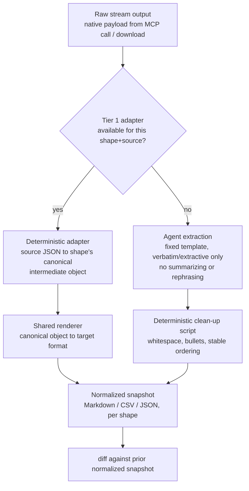

# OpenFlow — Proposed UX

**Status:** exploratory, captured from design conversation on 2026-09-02. Not yet an OpenSpec change.

## What it is

An open-source npm package that lets a knowledge worker keep a persistent, local, agent-usable
memory of the "streams" of information they work with — documents, threads, and conversations
that flow into their work and/or flow back out of it — so that a coding-agent-style tool (Claude
Code, Codex, Cursor, etc.) can help track what changed, queue up what needs a response, and work through
it with them over multiple sessions, without re-explaining context each time.

## Naming

- Package: `OpenFlow` (name chosen to be simple to get started with; `OpenFlow` is an overloaded
  term elsewhere in tech, but nothing here depends on that name being unique)
- Install: `npm install -g @stevenpal/openflow@latest`
- Terminology: tracked things are called **streams**, not "documents," "sources," or "artifacts."
  - **Static stream**: a one-time snapshot that will never be re-synced — a meeting transcript, a
    PDF, a news article. Added once, never diffed against a later version. `last_synced_at` stays
    unset forever.
  - **Syncable stream**: a live channel expected to change over time and worth diffing on each
    `/flow:sync` — a Slack thread, a Google Doc, a query. May be one-way (read-only extraction,
    e.g. a news feed) or two-way (the user also reads updates and pushes changes/replies back,
    e.g. a Slack thread or Google Doc).
- A second, orthogonal axis to static/syncable is **origin**: whether a stream's content comes
  from an external system, or is computed from other streams already in the workspace.
  - **Source stream**: content comes directly from an external system (a Slack thread, a Google
    Doc, a query, a file). Everything described above is a source stream. This is the default and
    the only origin that existed before derived streams were introduced.
  - **Derived stream**: content is produced by transforming one or more source streams already in
    the workspace — e.g. running a SQL-query stream's CSV output through pandas to get a
    trend-by-day summary, or consolidating several competitor-pricing web-page streams into one
    comparison sheet. See [Derived streams](#derived-streams) below.

## Requirements

- Node.js installed.
- An agent harness that supports skills (e.g. Claude Code, Codex, OpenClaw, Hermes, Cursor, etc.).
- Optional: MCP servers configured in that harness for the streams the user cares about (e.g.
  Google Docs MCP, Slack MCP, MongoDB MCP). Not required to use OpenFlow at all — a stream can be
  added via a raw file or URL with no MCP server behind it — but a configured MCP server is what
  lets `/flow:sync` pull a live update itself instead of asking the user to paste in the latest
  content.

## Supported stream types

Streams fall into a small number of content **shapes**, not one bespoke type per source app —
this is what keeps normalization from turning into a library of per-source extractors (see
[Raw → normalized conversion](#raw--normalized-conversion) below). The agent's job at add/sync
time is to recognize which shape a given stream falls into, then render it into that shape's
fixed target format so later diffing always runs against a consistent, cheap-to-diff
representation instead of each source's native structure.

| Shape | Examples | Normalizes to |
|---|---|---|
| Chat / messaging & social thread | Slack, Microsoft Teams, Discord, WhatsApp, Telegram, iMessage, Zoom/Meet chat, SMS, Intercom/Zendesk/Front support conversation, GitHub PR & issue comments, GitHub Discussions, Twitter/X thread, LinkedIn post + comments, Mastodon/Bluesky thread | Markdown (transcript form: `[author, timestamp]: text`, preserving thread/reply nesting) |
| Structured rich-text doc | Google Docs, Microsoft Word / DOCX, PDF (text-based), Notion page, Confluence page, wikis (MediaWiki, Wikipedia, internal wiki), Obsidian note, Joplin note, Apple Notes, Evernote, Dropbox Paper, Coda doc, Quip, Craft, GitHub README/wiki, RTF | Markdown — body reflects accepted-state-only content (pending suggestions excluded), with comments and pending track-changes each rendered as their own trailing section (see [Comments and track changes](#comments-and-track-changes)) |
| Tabular / spreadsheet | Google Sheets, Excel / XLSX, Airtable base, Notion database, Coda table, CSV file | CSV (or a Markdown table for small grids) |
| Presentation / slide deck | Google Slides, PowerPoint / PPTX, Keynote, Canva (text layers), Figma (text/comments only) | Markdown (content-only: `slide N: title / bullets / speaker notes`, in order; comments as a separate section — visual layout is intentionally lost) |
| Web page | News article, blog post, documentation page, Wikipedia article, Reddit thread, Hacker News thread, product/marketing page, Stack Overflow question + answers, Discourse forum thread | Markdown (readability-extracted body content) |
| Email | Gmail, Outlook, generic IMAP mailbox, mailing-list digest (Google Groups), newsletter/Substack email | Markdown (header block — from/to/subject/date — followed by body) |
| Query / API result | SQL (Postgres, MySQL, Snowflake, BigQuery), MQL (MongoDB), GraphQL, generic REST endpoint, Elasticsearch/OpenSearch, product analytics (Amplitude, Mixpanel), dashboard queries (Grafana, Datadog), Google Analytics, RevenueCat | CSV for tabular results, JSON for nested/object results |
| Audio / video transcript | Zoom/Meet recording transcript, Otter.ai, Fireflies.ai, YouTube video transcript, podcast transcript | Markdown transcript (`[speaker, timestamp]: text`) |
| Project/task tracker item | Jira ticket, Linear issue, Asana task, Trello card, GitHub issue | Markdown (metadata block — status/assignee/labels — followed by description, then comments as a transcript section) |
| Plain text / code / config file | `.txt`, log file, source code file, YAML/JSON/TOML config, `.md` file | Left as-is (plain text / fenced code), no rendering step needed |

Some of these shapes cover collaboration features (comments, suggestions, track changes) that are
richer than plain body content — see [Comments and track changes](#comments-and-track-changes)
for how those are kept out of the body while still staying diffable.

### Comments and track changes

Comments and track-changes/suggested-edits aren't the same kind of thing, so they're handled
differently rather than both being jammed into one generic "collaboration" section:

- **Body text** is always rendered as accepted-state-only content — pending suggestions are
  excluded, as if track changes didn't exist. This keeps the body diff answering exactly one
  question ("what actually changed in the real content since last sync") without pending,
  not-yet-accepted edits muddying it. Inlining suggestions into the body (e.g. as
  insert/delete markup) was considered and rejected: it would mean the body diff mixes "content
  that changed" with "content someone merely proposed changing," which is a different kind of
  news and shouldn't collapse into the same diff.
- **Comments** get their own trailing section, one entry per comment, each carrying a short
  quoted anchor snippet (a few words of the surrounding text it's attached to) alongside
  author/timestamp/text — enough spatial context for the agent to judge relevance without
  inlining the comment into the body itself. Inlining was also considered and rejected: comment
  anchor spans (exactly which words are highlighted) are a rendering decision, and if that
  decision isn't perfectly stable run to run, it becomes diff noise on the body even when nobody
  edited any text — the opposite of what normalization is for.
- **Track changes / suggested edits** also get their own trailing section, listing each pending
  suggestion (who proposed it, what it would insert/delete, where). Because the body is
  accepted-state-only, a newly proposed edit doesn't show up in the body diff at all — it shows
  up here, as a new entry in this section's diff, which is exactly the "someone proposed a change"
  signal the sync needs. Once a suggestion is accepted upstream, it disappears from this section
  on the next sync and the body diff picks up the actual content change at that point.

This gets both things the user cares about out of one merged-body-plus-two-sections rendering: the
body diff cleanly shows real content changes (insertions/modifications/deletions fall out of the
normal `diff` on merged text, no special handling needed), and the two trailing sections
independently surface *who* is discussing or proposing what, with the metadata `diff` on
those sections showing new/resolved comments and new/accepted suggestions as their own deltas.

## Setup

```
npm install -g @stevenpal/openflow@latest
mkdir my-workspace && cd my-workspace
openflow init
```

`openflow init` scaffolds the workspace in the current folder:
- Installs the skills/scripts the agent will use (plus any node_modules they depend on)
- Creates the folders needed once the user starts adding/syncing streams
- Sets up the initial intent ledger

Each workspace (folder) has exactly one ledger and is fully independent. If the user has
genuinely unrelated projects — even ones that happen to touch some of the same streams — the
answer isn't a "projects" concept inside OpenFlow, it's a second folder with its own
`openflow init`, worked in its own Claude Code window. That keeps any chance of posting to the
wrong Google Doc or Slack thread structurally impossible: an agent working in one workspace never
has another workspace's streams in scope. Within a single workspace, semantic grouping across
streams (see `/flow:work` below) covers the softer need for "projects" as a way of organizing and
summarizing related work — without the risk that a shared workspace-splitting concept would add.

## Command surface

All commands are slash-invoked skills, prefixed `/flow:`. Each one is an entry point that loads
the relevant context (ledger, queue, stream snapshots) for its situation, but taking action on a
stream — replying in Slack, editing a Google Doc, updating a snapshot — isn't gated behind any one
of them; `/flow:add`, `/flow:sync`, and `/flow:manage` can all act immediately when the fix is
obvious, not just queue it up. `/flow:work` exists for the case none of the others cover: resuming
work on the queue cold, without having just run `add` or `sync` in this session.

| Command | Purpose |
|---|---|
| `/flow:add` | Add a source stream (URL, file, thread), or a derived stream defined as a transformation of one or more existing source streams. For a source stream: classifies it as static or syncable (see below), downloads/snapshots it locally, and records the exact retrieval recipe it used as the stream's `descriptor` in the intent ledger. For a derived stream: captures which source stream(s) feed it (`source_stream_ids`) and the transformation recipe (`descriptor`), and adds a ledger entry for it too. If the content implies something actionable (e.g. a meeting transcript with action items), allows the user to act on it immediately where easy — direct edits to affected streams and/or new queue items — rather than waiting for a future sync. |
| `/flow:sync` | Pull the latest version of every syncable source stream, diff each against its last local snapshot, and re-run any derived stream whose source(s) changed. Summarizes what changed and works with the user to take action: projecting deltas based on immediate decisions into streams, adding items to the queue document (`queue.md` for now) when it needs longer-term user judgment. See [Sync execution model](#sync-execution-model) for how this fans out across subagents. |
| `/flow:manage` | Initiate a change to how a stream is tracked: toggle it between syncable and static, or remove it from the workspace entirely. Removing a stream deletes its local folder and its ledger entry — it never deletes or otherwise touches the remote document/thread/query it pointed to. |
| `/flow:work` | Bring the queue into context, summarized and grouped by intent/topic rather than as a flat list, and work through it with the user — resuming cold, without having just come from `add` or `sync` this session. When working an item draws on a stream in a way that changes or sharpens why it matters, rewrites that stream's `intents` list in the ledger in place. |
| `/flow:ask` | Deep research across all tracked streams for a question that doesn't map to a single queue item. |

## Adding a stream

To add a stream, the user provides one of:

- a file (dropped in or pointed to by path),
- a URL, or
- a description of the stream (e.g. a query string, or a document name/ID in a system like Google
  Docs).

Ideally alongside some context on *why* they're adding it — e.g. `/flow:add this Slack thread
with the sales AE for P&G, we need to deal with the customization requests related to XYZ`. That
context is captured as the stream's initial **intent** entry.

### Static vs. syncable classification

`/flow:add` has to decide whether the thing being added is a one-time snapshot (**static**) or a
channel worth re-checking over time (**syncable**). It doesn't ask by default — it infers from two
signals and states its guess so the user can correct it in one beat rather than answering a
blocking question:

- **Type default** — a Google Doc, Slack thread, or query defaults to syncable; a PDF, transcript,
  or web article defaults to static.
- **Prompt language override** — explicit intent in the add prompt wins over the type default.
  `/flow:add ... we'll be iterating and tracking this over time` → syncable, even for a file.
  `/flow:add ... it has action items relevant to project XYZ` → static, even for a live-URL type.

How much confirmation this gets depends on how established the ledger already is: while the
ledger has fewer than 5 entries, `/flow:add` appends a light inline confirmation note giving the
user a beat to correct it, e.g. "Classified as syncable (Google Doc default). To switch to static
or toggle sync, let me know now or run `/flow:manage` at any time." Once the ledger has 5 or more
entries, the user has enough of a feel for how the classifier guesses that the note shrinks to a
bare statement of the classification, e.g. "Classified as syncable (Google Doc default)." The
classification itself is stored per-entry in the ledger (see below) — it isn't a separate storage
location.

### Intent ledger

A single file (markdown or YAML — leaning YAML for straightforward scripted validation while
staying human-editable) listing every tracked stream, one per workspace. It's the primary context
artifact every `/flow:*` command reads before doing anything else. One entry per stream:

- `id` — unique stream id (e.g. `stream-123`)
- `descriptor` — unambiguous, literal instructions for the agent to (re)produce this stream's
  content; for a source stream, the exact retrieval recipe (e.g. "Use the Google Analytics MCP
  server to run a Data API report: propertyId=123, dimensions=[customdim1, customdim2],
  metrics=[activeUsers], dateRange=since last_synced_at"), or just a URL/file path when the
  retrieval has no parameters to lose; for a derived stream, the exact transformation recipe (e.g.
  "Take the CSV from `stream-011`, use pandas to build a histogram of occurrences by day of week;
  combine with the day-of-week summary CSV from `stream-022`; write one CSV with headings ..." —
  can reference a skill the user has set up, e.g. "run `/summarize-usage-data` over the new CSV").
  See [Descriptor: instructions, not a handle](#descriptor-instructions-not-a-handle) for why this
  has to be a literal recipe rather than a vague summary, and how it differs from `description`.
- `type` — one of the supported stream type enum values above (a derived stream typically takes
  the type of whatever it produces, e.g. a derived stream that writes to a Google Sheet is `type:
  structured rich-text doc`)
- `origin` — `source` or `derived` (see [Naming](#naming)). Kept as its own field, not folded into
  `descriptor`'s prose, because code needs to query it deterministically — validating the
  one-level-deep constraint, building the dependency graph for `/flow:sync` step 3, and figuring
  out what breaks if a stream is removed all require a structural query, not an agent re-reading
  and re-interpreting prose each time.
- `syncable` — `true`/`false`, set at add-time per the classification above; for a source stream,
  determines whether `/flow:sync` pulls it directly; for a derived stream, determines whether it's
  recomputed whenever its source(s) change (derived streams default to `true` — a derived stream
  added as static is just computed once at add-time and never revisited)
- `source_stream_ids` — derived streams only: the id(s) of the source stream(s) it's computed
  from. Must all be `origin: source` streams — a derived stream can't take another derived stream
  as an input (see [Derived streams](#derived-streams) for why). Structured for the same reason as
  `origin`: `/flow:manage` needs to answer "what depends on this stream" before removing it, and
  `/flow:sync` needs to answer "did any of this stream's sources change" — both are graph
  traversals, not something to re-derive from prose on every run.
- `description` — short human-readable description of what the stream is and why it matters; for
  the human, not the agent (contrast with `descriptor`, which is for the agent)
- `intents` — a curated, current-state list of why this stream matters, one entry per distinct
  intent it serves. Each entry is a paragraph of context, not a label — why the stream matters for
  that intent and what makes it relevant, not just a name for the intent. Rewritten in place,
  rather than appended to, whenever a command touches the stream's relevance. See
  [Intent entries: rewritten, not appended](#intent-entries-rewritten-not-appended).
- `added_at` — timestamp the stream was first added
- `last_synced_at` — timestamp of the most recent successful sync; stays unset for static streams
  (and for derived streams added as static)

### Intent entries: rewritten, not appended

`intents` is deliberately free text with no canonical registry behind it — no separate list of
named intents that stream entries reference by id. A registry would make matching more mechanical,
but real intents don't behave like rows in a table: they morph, sharpen, and split as work
progresses, and forcing them into stable named entities is more rigid than the work actually is.
Instead, matching a new trigger (an incoming Slack message, a synced doc change) against a stream's
past relevance is something the agent does by reading the prose and reasoning about it — the same
way `descriptor` stays prose rather than a structured retrieval schema (see
[Descriptor: instructions, not a handle](#descriptor-instructions-not-a-handle)) for the same
reason: there's nothing left to reinterpret, and nothing rigid to maintain.

Whenever `/flow:add`, `/flow:sync`, or `/flow:work` touches a stream's relevance — the stream gets
pulled into context to inform a decision, a sync reveals new information about why it matters, the
user explains a new angle on it — the command re-reads that stream's current `intents` list and
rewrites it, rather than appending a new entry. Concretely, that means deciding, case by case:

- **extends or sharpens an existing entry** — edit that entry's paragraph in place (e.g. a second
  Nike conversation makes the existing relevance paragraph more specific),
- **is a genuinely distinct intent** — add a new entry alongside the existing ones,
- **makes an existing entry stale** — drop it, if current context makes clear that intent no
  longer applies.

Append-only was considered and rejected. A stream that's referenced often — a PRD cited across many
Slack threads and meetings — would accumulate one entry per citation under an append-only scheme,
most of them near-duplicates of each other; the list would read like a changelog rather than a
summary of why the stream matters. Worse, a long list of old, loosely-relevant entries is itself a
drift risk: the agent skimming it for a match is more likely to key off a stale entry than the
current one. Rewrite-in-place keeps the list small and current — a heavily-referenced PRD should
still end up with a handful of sharp entries, not dozens.

This doesn't lose history, because it doesn't need to carry it. [Ledger versioning](#ledger-versioning)
already snapshots the ledger file before every mutation, so a superseded or dropped intent is
recoverable from a prior snapshot if anyone needs to know why a stream used to matter — the live
list only has to reflect what's true now.

### Descriptor: instructions, not a handle

`descriptor` and `description` answer different questions and shouldn't merge: `description` is
"why do we track this" (human-facing, feeds intent/queue framing); `descriptor` is "how does the
agent regenerate this content" (agent-facing, replayed on every sync). Collapsing `origin` and
`source_stream_ids` into `descriptor`'s prose was considered and rejected for the reason above —
those are consumed by code, not just by the agent's own reasoning — but `descriptor` itself stays
a single free-text field rather than splitting further into a structured retrieval schema (MCP
server / tool / parameters as separate keys). A structured schema would need its own shape per MCP
tool, which is exactly the "1000 extractors" problem the
[raw → normalized pipeline](#raw--normalized-conversion) already works to avoid — and it buys
nothing a well-written prose recipe doesn't already give, since the only consumer of `descriptor`
is the agent itself.

The risk that motivates this whole discussion — a later sync pulling the data in a subtly
different way (missing a filter, a different date grouping) and producing a misleadingly different
diff — doesn't come from `descriptor` being prose. It comes from that prose being a *summary* of
intent rather than a *literal recipe*. `"pull the WAU trend from Amplitude"` under-specifies the
call (which event? grouped how? over what window?) and invites a different agent, or the same
agent on a different day, to fill in the gaps differently. `"Use the Amplitude MCP server,
query_events with event=app_open, groupBy=day, dateRange=since last_synced_at,
filter=platform:ios"` is still prose, but it's complete — there's nothing left to reinterpret.
`/flow:add` is the one place this recipe gets written, and it's well-positioned to write it
precisely: it's the agent that actually executes the retrieval to produce the stream's first
snapshot, so the recipe it records in `descriptor` is exactly the call it just made — not a
paraphrase of the user's request, but a transcript of what actually happened. The same
confirmation-note pattern used for static/syncable classification applies here too: while the
ledger is young, `/flow:add` echoes the resolved descriptor back for the user to correct before
it's locked in as the resync recipe.

One case needs explicit handling either way: parameters that are intentionally relative rather
than fixed (last 7 days, since the last sync). Those have to be written into the descriptor as a
relative reference — `dateRange=since last_synced_at` — not frozen as an absolute value from
add-time, or every later sync silently stops picking up new data. This is a writing discipline for
`/flow:add` to follow, not a schema concern.

#### Relative dates

Relative dates need more care than most parameters, because the descriptor has to pin down not
just *what* window is meant but *when it's computed relative to*, and get that resolved the same
way on every sync regardless of which agent runs it.

For query-shaped streams (SQL, MQL) this is already solved: the descriptor is the query text
itself, so a native relative expression (`CURRENT_DATE - INTERVAL '7 days'`, `SYSDATE`, `NOW()`)
is resolved deterministically by the database engine at execution time. No OpenFlow-level
convention is needed there — the skill should just prefer the query language's own syntax over
anything else.

For structured MCP tool parameters that take concrete values (most dashboard/analytics/REST-style
tools take absolute `start`/`end` dates, not a relative expression), nothing resolves the value
automatically, so the descriptor has to spell out how it's computed — in plain English, not a
DSL. ISO 8601 durations were considered and rejected: `P7D` doesn't actually remove the ambiguity
(it still doesn't say what it's relative to, or whether either endpoint is inclusive), so it adds
notation without adding precision. Two things follow from that:

- **Compute the value with a script, not agent arithmetic**, for the same reason dates are pulled
  out of the agent's head everywhere else in this doc — quarter boundaries, week starts, and leap
  years are easy to get subtly wrong, and subtly wrong differently on different runs is exactly
  the drift this is trying to prevent. Two small composable primitives cover the common cases
  without growing into a script-per-period library: `get_date(anchor, offset?)` (anchor is `today`
  or `last_synced_at`; offset is a signed amount, e.g. `-7 days`) and `get_period_start(unit,
  date?)` (start of the week/month/quarter/year containing a date, defaulting to today). The exact
  call signature is a technical-design detail, not settled here, but should follow an existing,
  widely-known convention (day.js/moment.js-style arguments) rather than inventing new syntax —
  e.g. `get_date('20260201', 'add', 7, 'days')`.
- **The descriptor narrates the actual steps**, the same literal-recipe discipline as everything
  else in it — not "pull the last 7 days" but "call `get_date(today, -7 days)` for `start_date`
  and `get_date(today)` for `end_date`." This also means the two things a script call alone can't
  resolve have to be stated explicitly in the descriptor's prose, since neither plain English nor
  the scripts settle them on their own:
  - **Inclusive/exclusive endpoints** — e.g. "start_date inclusive, end_date exclusive."
  - **Timezone** — explicit per stream in the descriptor (e.g. "use UTC," "use Pacific Time,"
    "use the device's local timezone"), not a workspace-level default: the ledger is the only
    config surface this design has, and a single extra field for one setting isn't worth
    maintaining. When a descriptor doesn't mention timezone at all, the resolver defaults to
    **UTC** — never the device's local timezone, since that's non-deterministic across *where* a
    sync happens to run (a laptop today, a cloud agent tomorrow) and would reintroduce the same
    drift this section exists to prevent. "Device local" is only used when a descriptor asks for
    it explicitly.

Example descriptor using all of the above:

> Use the Amplitude MCP server, `query_events` tool, event=`app_open`, groupBy=day,
> filter=platform:ios. For the date range: call `get_date(today, -7 days)` for `start_date` and
> `get_date(today)` for `end_date` (both inclusive, calendar days, UTC).

### Stream storage layout

Static and syncable streams live side by side in the same place — there's no separate `memory/`
folder for static ones. Content that will never be re-synced isn't structurally different from a
stream nobody has touched in a while (both are frozen, both still need to be searchable by
`/flow:ask`), so splitting storage by sync behavior would just duplicate that distinction across
two conventions. Each tracked stream gets its own folder, named by its id (e.g.
`streams/stream-123/`). On add (and on every subsequent sync, for syncable streams):

- **Raw snapshot** — the unmodified downloaded payload for that sync, in its native shape (raw
  JSON for a Google Doc or Slack thread export, the PDF itself, etc.).
- **Normalized snapshot** — a plain-markdown rendering of the same content, produced from the raw
  snapshot, so later reasoning/diffing (by `/flow:sync`, `/flow:ask`, etc.) works against a
  consistent, cheap-to-diff format rather than re-parsing native formats each time.

Snapshots are timestamped/versioned within the stream folder so a sync can diff against the prior
normalized version to detect what changed.

### Ledger validation and mutation

The ledger is human-editable at any time — that's a deliberate feature (see
[Queue document](#queue-document), same philosophy) — but it also means it can end up
inconsistent: a broken enum value, an id typo, a `source_stream_ids` entry pointing at a stream
that no longer exists, a derived stream pointing at another derived stream. Two rules keep that
from silently corrupting behavior:

- **Agent writes go through scripts, not ad-hoc file edits.** `add_stream`, `remove_stream`, and
  `update_stream` are the only way an agent mutates the ledger — never a freeform rewrite of the
  YAML. Each one enforces the schema (required fields, enum values, unique ids) and referential
  integrity (every `source_stream_ids` entry exists and is `origin: source`) before it writes,
  the same way the [raw → normalized pipeline](#raw--normalized-conversion) pushes determinism
  into scripts wherever a mistake would otherwise be easy and costly.
- **Every `/flow:*` skill reads the ledger through a validating accessor, not the raw file.**
  Script-gated writes only catch agent-caused mistakes — a person can still hand-edit the YAML
  directly, so validation has to run on *read*, every time, regardless of who wrote last.
  `get_streams` (called at the start of `/flow:add`, `/flow:sync`, `/flow:manage`, and
  `/flow:work`, before any other action) runs the same schema and referential checks and reports
  — never silently drops — anything that fails: e.g. `"stream-045 skipped: source_stream_ids
  references stream-999, which doesn't exist."` The command then proceeds with the remaining valid
  streams rather than either hard-failing the whole ledger over one bad entry or hiding the problem
  by quietly filtering it out. Silent filtering was considered and rejected: a stream that stops
  being acted on with no visible signal undermines the trust/transparency this tool depends on —
  the user should learn about a broken entry from the very next command they run, not by noticing
  later that a stream went quiet.

### Ledger versioning

Before any mutation (`add_stream`, `remove_stream`, `update_stream`), the current ledger file is
snapshotted first — the same versioning treatment [stream snapshots](#stream-storage-layout)
already get, applied to the ledger itself. This covers two things: a person can recover from a bad
manual edit by diffing against or restoring the prior version instead of losing the whole ledger to
a typo, and every change to the ledger — agent- or human-made — has a traceable history rather than
only the current state being visible. It's also what backs intent history specifically: since
`intents` entries are rewritten in place rather than appended to (see
[Intent entries: rewritten, not appended](#intent-entries-rewritten-not-appended)), a superseded or
dropped intent isn't kept live in the ledger — it's recoverable from these snapshots instead.

## Raw → normalized conversion

Diffing is only as good as the normalized text it runs on — noisy normalization means noisy
diffs, and noisy diffs are what make `/flow:sync` useless. But guaranteeing clean, deterministic
output can't mean writing a bespoke extractor per source app; that's the "1000 extractors" trap.
The resolution is a two-tier pipeline, applied per stream **shape** (the rows in
[Supported stream types](#supported-stream-types)), not per source app:



**Tier 1 — adapter + shared renderer, keyed by shape.** An "extractor" isn't one blob per app;
it's two much smaller pieces that get reused:

- A **canonical intermediate shape**, one per row in the stream-types table — e.g. chat/messaging
  is always `{author, text, ts, thread_id}[]`, regardless of whether it came from Slack, Teams, or
  a GitHub PR thread.
- A **shared renderer**, one per canonical shape, that turns that intermediate object into the
  target format (Markdown transcript, CSV, etc.). Written once per shape (~10 total), never
  touched again when a new source of that shape is added.
- A thin, source-specific **adapter** whose only job is mapping that one source's native JSON
  field names onto the canonical shape. This is the only part that grows with source count, and
  it's small — field renaming, not parsing.

This is what keeps Tier 1 from ballooning: adding support for a new chat app is "write a 20-line
adapter," not "write a new markdown renderer." Example adapter, for Slack:

```typescript
// adapters/slack.ts
import type { CanonicalChatMessage } from "../shapes/chat";

interface SlackApiMessage {
  user: string;
  text: string;
  ts: string;           // Slack epoch-seconds-with-micros string, e.g. "1699999999.000200"
  thread_ts?: string;   // present on replies; absent/self on the root message
}

export function slackToCanonicalChat(
  messages: SlackApiMessage[],
): CanonicalChatMessage[] {
  return messages.map((m) => ({
    author: m.user,
    text: m.text,
    ts: new Date(Number(m.ts.split(".")[0]) * 1000).toISOString(),
    thread_id: m.thread_ts ?? m.ts,
  }));
}
```

`slackToCanonicalChat` never touches Markdown — it only maps fields. The shared
`renderChatToMarkdown(CanonicalChatMessage[])` renderer (used by Slack, Teams, Discord, or any
other chat-shaped adapter) is the only place that knows what the target Markdown transcript looks
like. A Teams adapter is the same shape of function with different field names in, same canonical
type out.

**Tier 2 — agent extraction + deterministic clean-up, for everything without an adapter.** The
long tail (a niche wiki, an internal tool, a source nobody's written an adapter for yet) still
gets normalized, just without Tier 1's guarantees:

- The agent is given the shape's fixed target template (the same one the Tier 1 renderer
  produces) and instructed to extract **verbatim, in reading order** — copy text into the
  template's structure, never summarize or rephrase. Paraphrasing is what turns "nothing actually
  changed" into a large, misleading diff; literal extraction doesn't have that failure mode even
  when the agent's exact wording choices vary slightly run to run.
- Whatever the agent produces is then passed through the *same* deterministic clean-up script
  regardless of source — trims whitespace, normalizes bullet/heading characters, stable-sorts
  anything whose order isn't semantically meaningful. This absorbs the last bit of incidental
  rendering variance so a real diff dominates it.

Both tiers land in the same place — a normalized snapshot in the shape's target format — so
`/flow:sync`'s diff step doesn't need to know or care which tier produced it. Tier 1 stays a
small, optional, community-extensible set of adapters (bounded by shape count × popular sources
per shape); Tier 2 means no source is ever unsupported, just less pristine to diff until someone
contributes an adapter for it.

## Derived streams

A derived stream isn't pulled from an external system — it's computed from one or more source
streams already in the workspace, using the free-text transformation recipe captured in its
`descriptor` at add time (see
[Descriptor: instructions, not a handle](#descriptor-instructions-not-a-handle)). The canonical
case: a query stream pulls a CSV of raw usage data via SQL, which isn't useful on its own for the
intent behind tracking it (e.g. "monitoring Q4 launch adoption"). A derived stream layered on top —
"summarize daily active usage from the CSV and flag whether the trend is up or down, using
pandas" — turns that raw pull into something the intent actually needs. Because it's captured as a
stream, it gets its own folder, its own snapshots, and its own intent(s), and it's searchable by
`/flow:ask` just like anything else.

The transformation doesn't have to be numeric — it can just as easily consolidate several
unrelated source streams, e.g. one web-page stream per competitor pricing page, transformed by a
skill that extracts pricing data from each and rolls it into one comparison sheet.

Two constraints keep this simple rather than turning into a general-purpose automation graph:

- **One level deep.** A derived stream's `source_stream_ids` must all be `origin: source` streams
  — never another derived stream. This is what rules out cycles without needing cycle detection:
  there's no chain to walk, just a flat fan-in from sources to a derived stream.
- **Triggered by source syncs, not scheduled independently.** A syncable derived stream is
  recomputed by `/flow:sync` whenever a source it depends on changes — it has no independent pull
  step of its own. If none of its sources changed on a given sync, it's left alone.

## Sync execution model

To avoid context drift when a workspace has many streams, `/flow:sync` doesn't diff every stream
itself in one long pass — it fans work out to subagents and stays focused on synthesis:

1. For each syncable **source** stream, the main sync agent dispatches a subagent scoped to just
   that stream: pull the latest version, diff against the last snapshot, and report back a
   structured finding (e.g. "no meaningful changes," or "15 new comments related to XYZ" with the
   relevant excerpts attached).
2. The main agent collects those findings and does the parts that need full workspace context
   itself: matching each finding against the stream's intent(s) in the ledger, deciding what's
   queue-worthy vs. actionable immediately, and writing intent-focused queue items. This step
   intentionally isn't delegated — a per-stream subagent only sees its own stream, not the ledger,
   so it can't reliably judge what an intent-focused item should say. When a finding changes or
   deepens why a stream matters, the main agent also rewrites that stream's `intents` list in
   place (see [Intent entries: rewritten, not appended](#intent-entries-rewritten-not-appended))
   rather than leaving the ledger's record of relevance stale until the next `/flow:add`.
3. Any derived stream whose source(s) came back with meaningful changes gets recomputed using its
   `descriptor` instructions, and the result is diffed/summarized the same way a source stream
   would be.

## Queue document

`/flow:sync` doesn't log raw changes ("5 new comments," "John and Mary replied") — it synthesizes
each detected change against the stream's intent(s) from the ledger and writes an **intent-focused**
item: what's actually being asked or decided, and why it matters, in enough detail that the user
(or the agent, on a later `/flow:work`) doesn't need to re-open the stream just to remember what's
going on.

Format is markdown, kept intentionally loose — the user should feel free to edit, reorder, comment
on, or delete items directly, e.g. if they've already replied in Slack themselves and the item is
moot. Enough light, consistent structure per item that the agent can reliably locate/update/remove
entries; everything past that is free text the agent doesn't depend on. One item:

```markdown
## Decide: push release to Q4 for project ABC dependency

- **Stream:** [Slack thread w/ Ed, #proj-abc-release](https://mycompany.slack.com/archives/...) (`stream-045`)
- **Intent:** Track release-timeline decisions for Project ABC
- **Detected:** 2026-09-02

Ed thinks we should push the release to Q4 because of dependencies on project ABC. Need to decide
whether to do that given the Q3 delivery commitment we already made to Acme Corp (see
`stream-012`).
```

- The heading is the short, actionable summary — what `/flow:work` lists/summarizes at a glance,
  grouped with related items by intent/topic rather than shown as a flat chronological list.
- The **Stream** line links straight back to the source when the stream type has a natural
  URL (Slack thread, Google Doc, web page, email) — a live link the user can click to go reply
  or edit themselves, no agent involved, if that's faster than routing through `/flow:work`.
  For stream types without a natural URL (a query, a local file) it links to the stream's local
  folder/descriptor instead.
- **Intent** repeats (or references) the ledger intent this item traces back to, so the "why does
  this matter" context survives even if the user reorders or skims the queue later.
- The body is the detailed narrative — the actual substance of what needs deciding or responding
  to, written the way you'd want to hand it to a colleague cold.

When an item is resolved — whether via `/flow:work`, or handled immediately during `/flow:add`
or `/flow:sync` — the default is to remove it from the queue; whether resolved items instead move
to a lightweight history/archive is an open question (see below).

## Resolved since the original draft

- ~~Whether a static, never-changing document (e.g. a meeting transcript) fits the "stream"
  model at all.~~ Resolved: `/flow:add` replaces `/flow:track` as the single entry point and
  classifies each add as static or syncable (type default + prompt-language override); static
  entries just have `syncable: false` and no `last_synced_at`.
- ~~Whether static/archived content needs its own storage location apart from live streams.~~
  Resolved: no separate `memory/` folder — static and syncable streams share `streams/`,
  distinguished only by the `syncable` ledger field.
- ~~Whether action-taking on a stream is exclusive to `/flow:work`.~~ Resolved: no —
  `/flow:add`, `/flow:sync`, and `/flow:manage` can all act on a stream directly when the fix
  is obvious; `/flow:work` is specifically for resuming cold, without a prior `add`/`sync` this
  session.
- ~~Whether the intent ledger stays a single flat file as tracked-stream count grows, or needs to
  split (e.g. one ledger file per stream, indexed).~~ Resolved: a single flat-file ledger per
  workspace, always. There's no per-stream ledger split.
- ~~Whether there needs to be a distinct "archived" state, separate from "not synced."~~
  Resolved: no — collapsing to a single synced/not-synced (`syncable` true/false) axis covers it,
  so there's no `/flow:archive` command; toggling sync off via `/flow:manage` is the only
  "stop tracking updates but keep it around" state, and removing a stream entirely (also via
  `/flow:manage`) is the only way to drop it from the workspace.
- ~~Whether `/flow:manage` and `/flow:work` fully replace the need for any notion of "projects,"
  or whether some lightweight clustering re-emerges once there are many active streams.~~
  Resolved: semantic grouping by intent happens inside `/flow:work` when it presents/summarizes
  the queue, rather than as a first-class "project" entity. A genuinely separate project — one
  where cross-posting into the wrong stream would be a real risk — gets its own workspace folder
  and its own `openflow init` instead.
- ~~How confident the type-default/prompt-language classification in `/flow:add` needs to be
  before it's trusted without a confirmation step.~~ Resolved: `/flow:add` gives a light inline
  confirmation note while the ledger has fewer than 5 entries, then drops to a bare statement of
  the classification once the user has seen enough of them to trust the pattern.
- ~~Native vs. agent-mediated extraction for the raw → normalized conversion step.~~ Resolved:
  two-tier pipeline per stream shape — a small set of deterministic adapter + shared-renderer
  pairs (Tier 1) for popular sources, falling back to agent extraction plus a deterministic
  clean-up pass (Tier 2) for everything else. See
  [Raw → normalized conversion](#raw--normalized-conversion).
- ~~How a stream's retrieval/transformation instructions are captured precisely enough that a
  later sync reproduces the same pull rather than drifting (e.g. missing a filter or dimension a
  prior run had).~~ Resolved: no separate structured retrieval field — `descriptor` itself carries
  the literal, complete recipe (exact MCP server/tool/parameters, or exact transformation steps for
  a derived stream), captured from the actual call `/flow:add` executes rather than a paraphrase of
  user intent; relative parameters (last 7 days, since last sync) are written as explicit relative
  references rather than frozen absolutes. See
  [Descriptor: instructions, not a handle](#descriptor-instructions-not-a-handle).
- ~~Whether `origin`/`source_stream_ids` should fold into `descriptor`'s prose now that `descriptor`
  is a full recipe, to keep the ledger schema smaller.~~ Resolved: no — they stay structured fields
  because code (not just the agent) needs to query them deterministically: validating the
  one-level-deep derived-stream constraint, building the dependency graph for sync/removal impact.
  `transformation` as a separate field was dropped instead, since it was redundant with the
  generalized `descriptor`.
- ~~Whether stream relevance should be tracked as a canonical, id-referenced registry of intents,
  or as free-text `intents` entries with no shared vocabulary — and, either way, whether new
  relevance context gets appended over time or overwrites what's there.~~ Resolved: no registry —
  intents are free text the agent matches by reading and reasoning about, not by id lookup, since
  real intents morph and split rather than behaving like stable named entities. And no append,
  either: `/flow:add`, `/flow:sync`, and `/flow:work` rewrite a touched stream's `intents` list in
  place (edit, add, or drop entries as warranted) so it stays a small, current summary rather than
  a changelog that grows with every reference. Ledger snapshots already back the history that would
  otherwise motivate appending. See
  [Intent entries: rewritten, not appended](#intent-entries-rewritten-not-appended).
- ~~Whether the ledger, being human-editable, needs any deterministic validation or protection
  against a bad hand-edit or agent-written inconsistency.~~ Resolved: agent writes go through
  `add_stream`/`remove_stream`/`update_stream` scripts that enforce schema and referential
  integrity; every `/flow:*` skill reads via a validating `get_streams` accessor that reports (never
  silently drops) invalid entries; the ledger file is snapshotted before every mutation, mirroring
  stream snapshot versioning, so a bad edit is recoverable and every change is traceable. See
  [Ledger validation and mutation](#ledger-validation-and-mutation) and
  [Ledger versioning](#ledger-versioning).

## Open threads this doesn't resolve yet

These came up earlier in the design conversation and still need to be reconciled with this
command surface before an OpenSpec proposal:

- Whether running a derived stream's transformation (step 3 of the sync execution model) should be
  delegated to its own subagent, the way source-stream diffing is, or stay with the main sync
  agent. Delegating it would need the main agent to pass along enough intent/ledger context for
  the subagent to do a good job, rather than just the transformation instructions — otherwise it
  risks the same loss of intent-awareness that keeps queue-item synthesis centralized.
